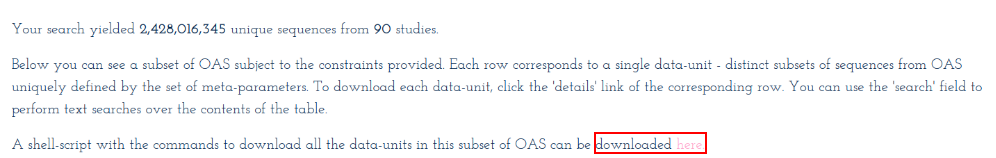

# AntiBERTa DEMO

## Important 
You can use your own data for saving to local storage or the cloud as well.

1. Unpaired sequences: [Unpaired GGdrive](https://drive.google.com/file/d/1Q__6zeiK0KxY6ihWEV0sSub4oPQT_sdx/view?usp=sharing)
2. Paired sequences: [Paired GGdrive](https://drive.google.com/file/d/1OH68jaB0E9IjOhV3a_j12WToS1W0Y1E0/view?usp=drive_link)

## 1. Setup
### 1.1 Access the OAS website

For the Masked Language Model, we need to use the OAS (Observed Antibody Space):

1. Access [OAS website](https://opig.stats.ox.ac.uk/webapps/oas/)

2. Click to the [Unpaired Sequences](https://opig.stats.ox.ac.uk/webapps/oas/oas_unpaired/)

3. Then, click the Search button below the "Search OAS sequences by attribute" section (no need to choose any filters).

4. Click the "here" 

5.  A window like this will appear: 

**Note**: Do the same with paired sequences

### 1.2 In Linux OS/Mac Os (optional)

1. Open the folder where you want to store the data in your local laptop.
2. Right click in the folder and choose **Open in terminal**.
3. Run this following command
```cmd 
bash bulk_download.sh
```
**Note**: You can rename the `bulk_download.sh` file to something else if you prefer.
4. 
- The unpaired sequences dataset used to train AntiBERTa and AntiBERTa2 is a very large file (>40GB).
- The paired sequences dataset used to train AntiBERTa2 only is smaller (~3.0GB).

### 1.2 In Window OS 

1. Download [Git Bash](https://git-scm.com/downloads/win)
2. Open the folder where you want to store the data in your local laptop.
3. Right click in the folder and choose `Show more options` -> choose `Open Git Bash`
4. 3. Run this following command
```cmd 
bash bulk_download.sh
```
**Note**: 
* You can rename the `bulk_download.sh` file to something else if you prefer.
* If you encounter an error regarding `wget`, you need to download `wget` for Windows.
5. 
- The unpaired sequences dataset used to train AntiBERTa and AntiBERTa2 is a very large file (>40GB).
- The paired sequences dataset used to train AntiBERTa2 only is smaller (~3.0GB).

### 1.3 Run the `mlm.ipynb` file
Run it sequentially from the beginning to the end, and save the checkpoints you want.
### 1.4 Run the `paratope_prediction.ipynb` file

**Note**: I have provided detailed comments in each notebook file.
